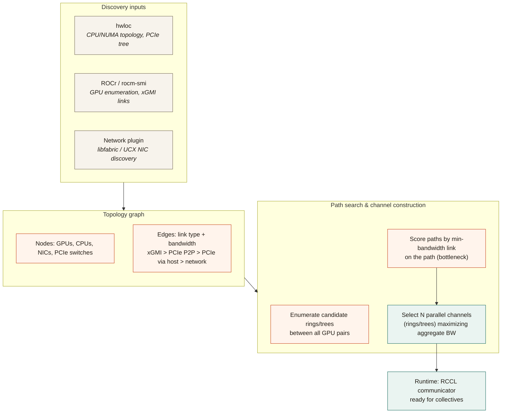
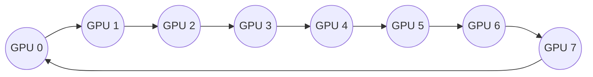
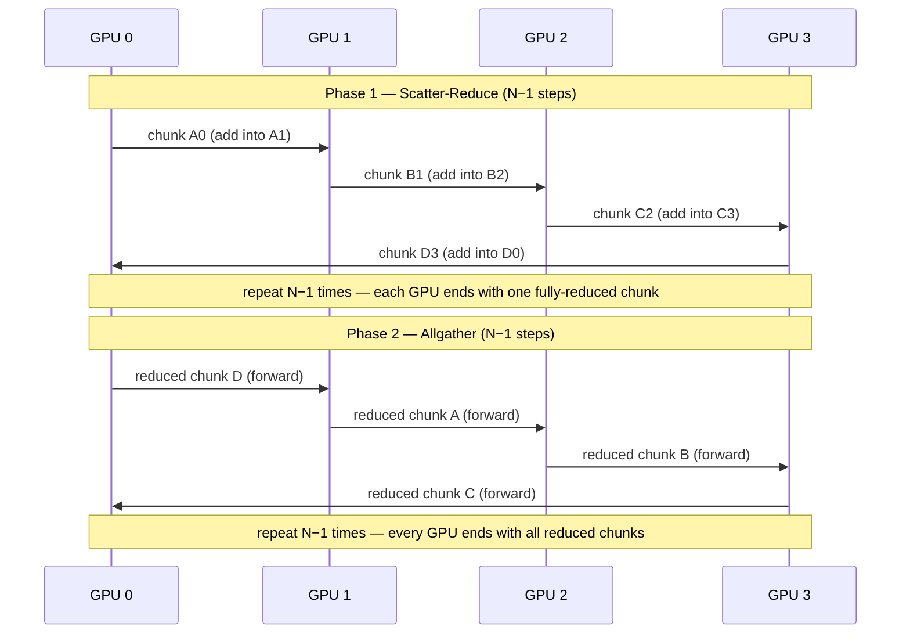
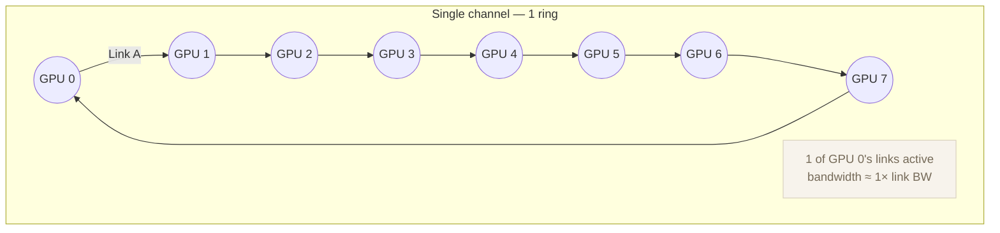
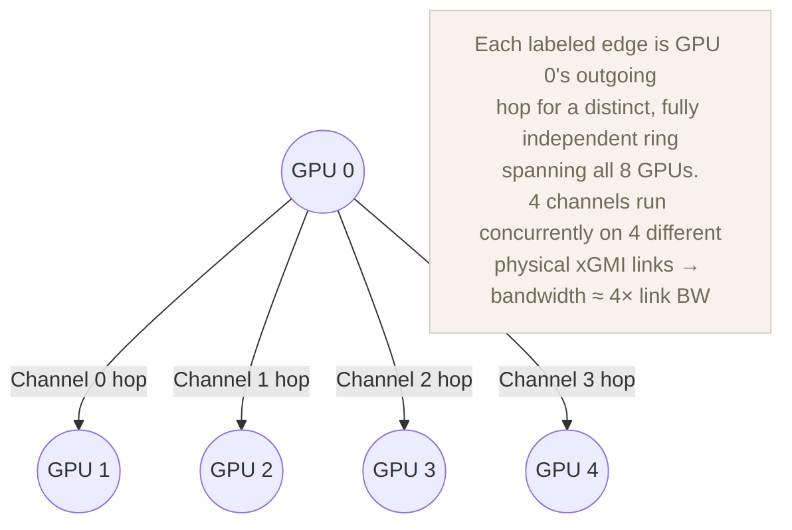

# RCCL — topology detection, ring algorithm, and multi-link parallelism

> **Note:** This is general RCCL/NCCL-family design knowledge, not sourced
> from this repo. RCCL's actual implementation lives in
> [`ROCm/rocm-systems/projects/rccl`](https://github.com/ROCm/rocm-systems/tree/develop/projects/rccl).
> Treat this as a conceptual reference, not a spec.

## Topology detection

At communicator init, RCCL discovers the system's compute and interconnect
layout, builds a weighted graph of it, then searches that graph for
communication paths before any collective ever runs.

## Ring algorithm

Each ring/channel connects every GPU to exactly two neighbors. Collectives
like all-reduce run in two pipelined phases — scatter-reduce, then allgather
— so every link in the ring stays saturated simultaneously instead of
funneling through one GPU.

## Multi-link parallelism

A single ring only uses **one** physical link per hop. On a densely
connected node — e.g. an 8-GPU MI300X OAM tray, where each GPU has direct
xGMI links to several (up to all 7) of the other GPUs — a lone ring leaves
the rest of those links idle. RCCL's fix is to run several **channels**
concurrently, each a fully independent ring (or tree) routed over a
*different* one of a GPU's available links, each driven by its own set of
GPU compute units.

Because each channel maps to its own compute units and rides a different
physical link, the channels execute genuinely in parallel at the hardware
level — not interleaved on one link — so achieved bandwidth scales toward
N × (single-link bandwidth), up to whatever bottleneck comes next (GPU
memory-controller aggregate bandwidth, or the weakest link if the topology
isn't fully symmetric).

| Channels active | GPU 0 links used | Aggregate bandwidth (approx.) |
|---|---|---|
| 1 (single ring) | 1 of 7 | 1× link BW |
| 4 (multi-channel) | 4 of 7 | ~4× link BW |
| 7 (fully saturated) | 7 of 7 | ~7× link BW (theoretical ceiling for GPU 0) |

The same principle extends one layer up to the network: **multi-rail**
support lets a multi-node collective drive several NICs concurrently
(one network channel per HCA) instead of funneling all inter-node traffic
through a single NIC.

This is specifically valuable on dense, direct-link-rich topologies (like
MI300X's 8-GPU tray). On smaller GPU counts or older, less-connected
interconnects, there are fewer independent physical paths to exploit, so
channel count — and the benefit from this technique — naturally drops.
